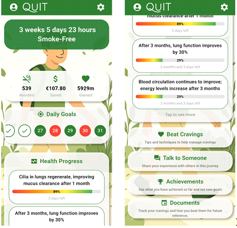
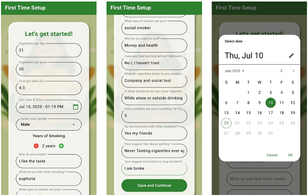
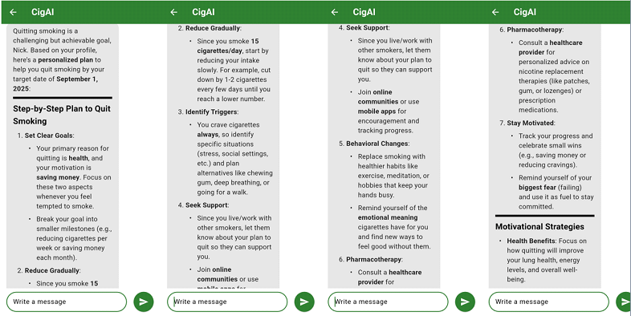
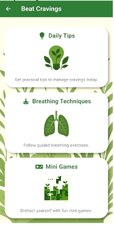
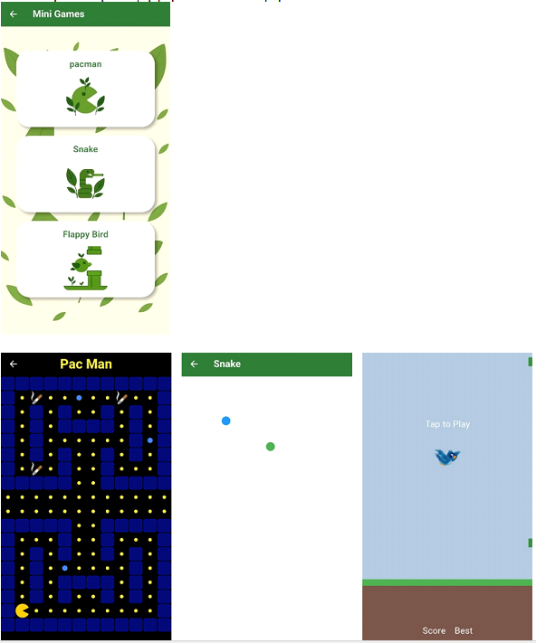
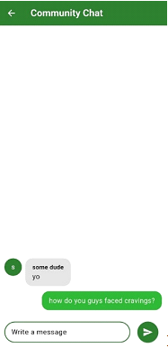
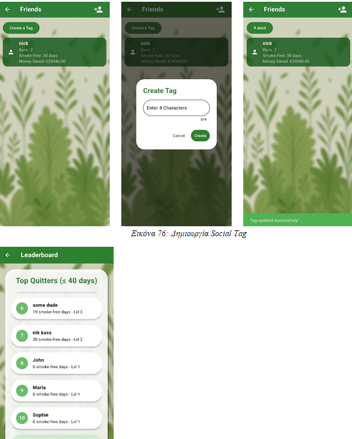
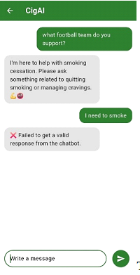
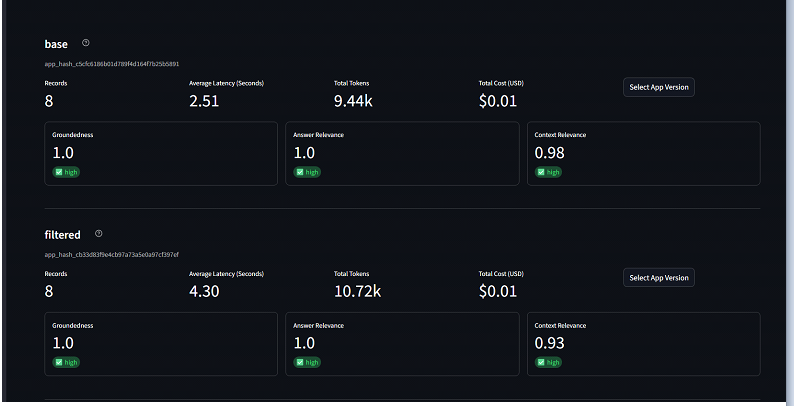

# AI-Assisted Smoking Cessation Platform

> **Diploma Thesis — National Technical University of Athens (NTUA), School of Electrical and Computer Engineering**

A full-stack **mobile health platform for smoking cessation**, combining a cross-platform Flutter application, Firebase cloud infrastructure, behavioral-support and gamification mechanisms, and a personalized **Retrieval-Augmented Generation (RAG) conversational assistant**.

The project explores how mobile health technologies and Large Language Models can be combined to provide **personalized, context-aware and evidence-grounded support** throughout the smoking-cessation journey.

<p align="center">
  
  
  
</p>

---

## 📄 Diploma Thesis

The complete research background, requirements analysis, system design, implementation methodology and evaluation are documented in the accompanying Diploma Thesis.

> **[Read the full Diploma Thesis (PDF)](documents/thesis.pdf)**

The thesis covers the complete development lifecycle, including smoking-cessation research, requirements engineering, UML system modeling, Flutter/Firebase implementation, chatbot architecture, RAG, personalization, LLM evaluation, limitations and future work.

---

## Project Overview

The system was designed as an **end-to-end digital smoking-cessation platform**, rather than as a standalone tracking application or generic AI chatbot.

It integrates four major subsystems:

* **Flutter mobile client** for user interaction and behavioral-support functionality
* **Firebase cloud infrastructure** for authentication, persistence, synchronization and messaging
* **FastAPI backend** for AI orchestration and user-aware conversational processing
* **RAG-based LLM subsystem** for domain-grounded and personalized conversational support

The application combines self-monitoring, psychological support, social interaction and gamification with generative AI.

### Core Capabilities

* Personalized onboarding questionnaire
* Smoke-free progress and health tracking
* Cigarettes avoided and financial savings
* Daily and health-related goals
* Achievements, XP and ranking system
* Craving logging and coping mechanisms
* Guided breathing exercises
* Distraction-oriented mini-games
* Friends, leaderboard and community chat
* Push and scheduled notifications
* Personalized RAG-based AI assistant
* Persistent conversational memory
* Semantic off-topic filtering
* External search fallback
* Automated LLM/RAG evaluation

---

# System Architecture

The application follows a modular architecture separating the **presentation layer, state management, application services, cloud infrastructure and AI subsystem**.

The Flutter client uses a Provider-based architecture in which UI screens communicate with dedicated state-management providers and service classes. Firebase handles persistent cloud functionality, while conversational requests are forwarded to a separate FastAPI/LangChain backend.

<p align="center">
  
</p>

> **UML source:** [`UML/component_diagrams.wsd`](UML/component_diagrams.wsd)

### Main Architectural Layers

| Layer            | Responsibility                                                         |
| ---------------- | ---------------------------------------------------------------------- |
| **Flutter UI**   | Screens and user interaction                                           |
| **Providers**    | Application state and business logic                                   |
| **Services**     | Authentication, Firestore, notifications and chatbot API communication |
| **Firebase**     | Authentication, persistent data and messaging                          |
| **FastAPI**      | AI API and request orchestration                                       |
| **LangChain**    | Retrieval, prompting and conversation management                       |
| **ChromaDB**     | Local vector knowledge base                                            |
| **LLM Provider** | Response generation                                                    |
| **Serper**       | External retrieval fallback                                            |

---

# Technology Stack

| Layer                    | Technologies                                  |
| ------------------------ | --------------------------------------------- |
| **Mobile Application**   | Flutter, Dart                                 |
| **Architecture / State** | Provider                                      |
| **Local Persistence**    | Hive, SharedPreferences                       |
| **Authentication**       | Firebase Authentication, Google Sign-In       |
| **Cloud Database**       | Cloud Firestore                               |
| **Cloud Storage**        | Firebase Storage                              |
| **Notifications**        | Firebase Cloud Messaging, Local Notifications |
| **Backend API**          | Python, FastAPI                               |
| **AI Orchestration**     | LangChain                                     |
| **Vector Store**         | ChromaDB                                      |
| **Embeddings**           | HuggingFace Sentence Transformers             |
| **LLM**                  | DeepSeek via OpenRouter                       |
| **External Retrieval**   | Serper API                                    |
| **AI Evaluation**        | DeepEval, TruLens                             |

---

# Mobile Application

## Personalized Onboarding

During first-time setup, users complete a questionnaire describing their smoking habits, cessation goals and personal motivations.

Collected information can include:

* cigarettes smoked per day
* cigarette pack size and cost
* smoking history
* quit date
* previous quit attempts
* craving situations
* smoking environment
* confidence level
* emotional relationship with smoking
* fears related to quitting
* personal motivation

This profile becomes part of both the application experience and the AI personalization pipeline.

<p align="center">
  
</p>

---

## Progress & Health Tracking

The application continuously transforms the user's cessation journey into measurable feedback.

Users can monitor:

* smoke-free duration
* cigarettes avoided
* estimated money saved
* health recovery milestones
* daily goals
* achievements
* XP and ranking
* personal progress statistics

<p align="center">
  
</p>

---

## Gamification

Gamification is integrated as a motivational mechanism rather than as an isolated UI feature.

Users earn **experience points (XP)** by completing achievements and reaching milestones.

The leaderboard dynamically ranks users according to their accumulated progress, while achievements provide additional positive reinforcement throughout the cessation journey.

The system includes:

* XP-based progression
* achievements
* dynamically calculated ranks
* leaderboard
* friend progress
* milestone-based rewards

---

## Craving Management

The platform provides multiple tools intended for moments of increased craving:

* guided breathing techniques
* craving logging
* daily cessation tips
* motivational content
* distraction-oriented mini-games
* community support
* AI conversational support

<p align="center">
  
  
</p>

Implemented mini-games include:

* Snake
* Pac-Man
* Tic-Tac-Toe

---

## Social & Community Support

The platform provides a social layer designed to complement individual progress tracking.

Features include:

* friend connections
* friend progress
* community chat
* craving-related community interaction
* leaderboard
* achievements

<p align="center">
  
  
</p>

Firestore real-time synchronization allows changes related to community features, cravings and rankings to propagate across clients.

---

# Personalized AI Assistant

A central contribution of the thesis is the implementation of a **domain-specific conversational assistant for smoking cessation**.

The chatbot does not simply forward user messages to a general-purpose LLM.

Instead, the backend combines:

**user profile + conversation history + retrieved smoking-cessation knowledge + current query**

to construct a context-enriched request for the language model.

<p align="center">
  
</p>

> **UML source:** [`UML/component_diagrams.wsd`](UML/component_diagrams.wsd)

---

## Semantic Domain Filtering

Before invoking the complete RAG pipeline, the backend performs a **semantic relevance check**.

The classifier uses:

```text
SentenceTransformer: all-MiniLM-L6-v2
Similarity:          Cosine Similarity
```

The incoming message is embedded and compared against pre-encoded smoking-related examples.

Queries below the configured semantic-similarity threshold are classified as off-topic and rejected before expensive retrieval or LLM operations are performed.

This provides:

* domain control
* reduced unnecessary API usage
* reduced token consumption
* predictable handling of unrelated questions

<p align="center">
  
</p>

---

# Retrieval-Augmented Generation

The conversational backend uses **Retrieval-Augmented Generation (RAG)** to ground generated responses in a dedicated smoking-cessation knowledge base.

## Knowledge Ingestion

Source documents are processed before inference.

The ingestion pipeline performs:

1. document loading
2. text extraction
3. text splitting into manageable chunks
4. semantic embedding
5. persistent vector storage

Documents are divided into chunks of approximately **500 tokens** before embedding.

The embedding model used for the knowledge base is:

```text
paraphrase-MiniLM-L3-v2
```

through `HuggingFaceEmbeddings`.

The resulting vectors are persisted locally using **ChromaDB**.

Implementation:

```text
lib/chatbot_backend/ingest_documents.py
```

---

## Retrieval Pipeline

At query time, the user's message is transformed into an embedding and compared against the stored vectors.

Relevant document chunks are retrieved and supplied to the LLM together with the personalized user context.

This separates two important responsibilities:

**Retriever**

Identifies relevant information from the domain knowledge base.

**Generator**

Uses the retrieved context to construct the final natural-language response.

The architecture reduces reliance on the model's internal knowledge and provides a mechanism for generating more **grounded, domain-specific responses**.

---

# Contextual Personalization

Before generation, the backend retrieves the authenticated user's profile from **Cloud Firestore**.

A structured contextual prompt is constructed from relevant profile attributes such as:

```text
cigarettesPerDay
costPerPack
quitDate
smokingYears
whyQuit
emotionalMeaning
biggestFear
biggestMotivation
```

This context is combined with the current message before inference.

As a result, users asking similar questions can receive different responses based on their smoking history, motivations and cessation progress.

<p align="center">
  
</p>

---

# Persistent Conversation Memory

The chatbot maintains conversation history through LangChain's:

```text
ConversationBufferMemory
```

Conversation state is maintained independently for each user and persisted between interactions.

User-specific memory can be serialized locally and restored in future sessions, allowing the assistant to maintain continuity across conversations rather than treating every request as stateless.

The QA chain is also initialized once during the backend lifecycle, avoiding repeated loading of the embedding infrastructure and vector database for every request.

---

# External Search Fallback

When the internal retrieval pipeline cannot provide sufficient context, the backend supports an additional retrieval mechanism through the **Serper API**.

This allows the conversational pipeline to retrieve supplementary web information before producing the final response.

The fallback is therefore used as a secondary retrieval mechanism rather than replacing the curated local knowledge base.

---

# Chatbot Deployment

The thesis additionally models the deployment of the AI subsystem separately from the application-level component architecture.

<p align="center">
  
</p>

> **UML source:** [`UML/deployment_diagrams.wsd`](UML/deployment_diagrams.wsd)

The modeled deployment consists of:

* Flutter mobile client
* HTTPS/ngrok communication layer
* FastAPI backend
* LangChain orchestration engine
* ChromaDB vector store
* persistent user/session memory
* Firebase user profiles
* external LLM provider
* Serper search API

This separation keeps AI orchestration, external credentials and retrieval infrastructure outside the mobile client.

---

# Backend API

The conversational subsystem is exposed through a **FastAPI REST API**.

Primary endpoint:

```http
POST /chat/
```

Example request:

```json
{
  "userId": "<firebase-user-id>",
  "message": "<user-message>"
}
```

The backend coordinates:

1. request validation
2. user identification
3. semantic domain classification
4. Firestore profile retrieval
5. conversation-memory loading
6. vector retrieval
7. contextual prompt construction
8. LLM inference
9. optional fallback retrieval
10. memory persistence
11. response delivery

Logging is included throughout the pipeline to provide visibility into semantic classification, profile retrieval and AI processing.

---

# LLM & RAG Evaluation

Because the conversational assistant operates in a health-related domain, evaluation was treated as a dedicated part of the thesis rather than relying exclusively on subjective inspection of generated responses.

Two complementary evaluation frameworks were used:

* **DeepEval**
* **TruLens**

The objective was to evaluate both the **quality of generated answers** and the behavior of the **retrieval pipeline**.

---

## DeepEval

DeepEval was used to implement reproducible automated tests over recorded chatbot interactions.

The evaluation workflow consists of two stages:

```text
Chatbot Interaction
        ↓
Structured Logging
        ↓
logs.jsonl
        ↓
DeepEval Test Cases
        ↓
LLM-as-a-Judge
        ↓
Evaluation Metrics
        ↓
deepeval_report.csv
```

The evaluation uses **GPT-4o-mini as the judge model**, independently from the main DeepSeek conversational model.

### Metrics

| Metric                   | Evaluates                                                         |
| ------------------------ | ----------------------------------------------------------------- |
| **Answer Relevancy**     | Whether the generated answer addresses the user's question        |
| **Faithfulness**         | Whether claims in the response are supported by retrieved context |
| **Contextual Precision** | Whether retrieved context is relevant and appropriately ranked    |

Scores are normalized to the `[0, 1]` range.

The thesis reports consistently high scores across the evaluated interactions, with several representative test cases achieving **1.0 across all three metrics**.

This included both general cessation questions and more context-dependent questions involving previous quit attempts and persistent cravings.

---

## TruLens

**TruLens** was used as a complementary evaluation and observability framework.

While DeepEval focuses on reproducible automated testing, TruLens provides additional visibility into the execution of the RAG pipeline through:

* tracing
* feedback functions
* retrieval analysis
* faithfulness evaluation
* relevance evaluation
* interactive dashboards

The RAG pipeline was wrapped with TruLens instrumentation so that queries, retrieved information and generated responses could be analyzed throughout the execution path.

The thesis reports similarly high evaluation scores, with small differences attributed to the more limited knowledge base used in the notebook evaluation and slight modifications required to instrument the RAG pipeline.

The two approaches therefore serve complementary purposes:

| DeepEval                    | TruLens                       |
| --------------------------- | ----------------------------- |
| Automated LLM tests         | Runtime observability         |
| Reproducible evaluation     | Pipeline tracing              |
| Metric-based validation     | Retrieval/generation analysis |
| Regression-oriented testing | Diagnostic analysis           |

---

## Evaluation Results

The recorded evaluation demonstrates strong performance in:

* answer relevance
* faithfulness to retrieved knowledge
* contextual retrieval quality
* consistency across different queries

<p align="center">
  
</p>

These results should be interpreted as an **experimental evaluation of the implemented system**, rather than as a clinical validation.

The thesis explicitly identifies limitations of automated **LLM-as-a-Judge** evaluation and highlights human evaluation and testing with real smokers as important directions for future validation.

---

# Firebase & Data Layer

Firebase provides the application's primary cloud infrastructure.

### Firebase Authentication

Supports authenticated user accounts and Google Sign-In.

### Cloud Firestore

Stores application state including user profiles and data related to:

* progress
* achievements
* leaderboard
* friends
* craving logs
* daily tips
* community functionality

### Firebase Cloud Messaging

Provides push notifications and scheduled motivational reminders.

### Real-Time Synchronization

Firestore synchronization enables application data such as leaderboard, community and craving information to update across clients.

Selected information can additionally benefit from local caching for improved availability.

---

# UML & Software Design

The repository contains the UML documentation produced during the design of the system.

```text
UML/
├── activity_diagrams.wsd
├── class_diagram.wsd
├── component_diagrams.wsd
├── deployment_diagrams.wsd
├── er_diagram.wsd
├── sequence_diagrams.wsd
└── usecase_diagmram.wsd
```

The diagrams cover:

* **Use Case Diagrams** — user and system functionality
* **Activity Diagrams** — application workflows
* **Sequence Diagrams** — interactions between system components
* **Class Diagram** — software structure and relationships
* **ER Diagram** — persistent data model
* **Component Diagrams** — application and chatbot architecture
* **Deployment Diagrams** — physical/service deployment

The original PlantUML source files are included to keep the architectural documentation version-controlled alongside the implementation.

---

# Project Structure

```text
Smoking-Cessation-App/
│
├── documents/
│   └── thesis.pdf
│
├── screenshots/
│   ├── home_screen.PNG
│   ├── questionnaire.PNG
│   ├── personalized_answers.PNG
│   ├── beat_cravings.PNG
│   ├── community_chat.PNG
│   ├── social.PNG
│   ├── logs.PNG
│   ├── evaluation.PNG
│   └── ...
│
├── UML/
│   ├── activity_diagrams.wsd
│   ├── class_diagram.wsd
│   ├── component_diagrams.wsd
│   ├── deployment_diagrams.wsd
│   ├── er_diagram.wsd
│   ├── sequence_diagrams.wsd
│   └── usecase_diagmram.wsd
│
├── lib/
│   ├── chatbot_backend/
│   │   ├── main.py
│   │   ├── langchain_logic.py
│   │   ├── firebase.py
│   │   ├── user_memory.py
│   │   ├── ingest_documents.py
│   │   ├── create_logs.py
│   │   ├── evaluate_with_deepeval.py
│   │   └── requirements.txt
│   │
│   ├── mini_games/
│   ├── models/
│   ├── providers/
│   ├── screens/
│   ├── services/
│   ├── utils/
│   ├── widgets/
│   ├── firebase_options.dart
│   └── main.dart
│
├── assets/
├── pubspec.yaml
├── LICENSE
└── README.md
```

---

# Installation & Development

## Prerequisites

**Mobile**

* Flutter SDK
* Dart SDK
* Android Studio or compatible IDE
* Android emulator / physical device
* Firebase project

**AI Backend**

* Python 3.10+
* `pip`
* Firebase Admin credentials
* OpenRouter API credentials
* Serper API credentials
* OpenAI API credentials for DeepEval evaluation

Verify Flutter:

```bash
flutter doctor
```

---

## Clone

```bash
git clone https://github.com/Kassaris/Smoking-Cessation-App.git
cd Smoking-Cessation-App
```

## Flutter Dependencies

```bash
flutter pub get
```

## Firebase

The Flutter application uses:

```text
lib/firebase_options.dart
```

Platform-specific configuration should be provided locally where required.

```text
Android → android/app/google-services.json
iOS     → ios/Runner/GoogleService-Info.plist
```

Firebase Admin credentials and private service-account files must **not** be committed to source control.

---

## AI Backend

```bash
cd lib/chatbot_backend
python -m venv .venv
```

Linux/macOS:

```bash
source .venv/bin/activate
```

Windows:

```bash
.venv\Scripts\activate
```

Install dependencies:

```bash
pip install -r requirements.txt
```

Configure the required environment variables:

```env
OPENROUTER_API_KEY=
SERPER_API_KEY=
OPENAI_API_KEY=
FIREBASE_CREDENTIALS_PATH=
RAG_LOG_PATH=./logs.jsonl
DEEPEVAL_OUT=deepeval_report.csv
```

> Never commit API keys, `.env` files or Firebase service-account credentials.

---

## Prepare the Knowledge Base

Run the document-ingestion pipeline to create the local Chroma vector store:

```bash
python ingest_documents.py
```

---

## Start the Backend

```bash
uvicorn main:app --host 0.0.0.0 --port 8000
```

The service exposes:

```text
GET  /
POST /chat/
```

---

## Run the Mobile Application

From the repository root:

```bash
flutter run
```

For an Android emulator communicating with a locally hosted backend, the host machine is commonly available through:

```text
10.0.2.2
```

rather than `localhost`.

---

# Evaluation Workflow

Generate or collect chatbot interaction logs:

```bash
python create_logs.py
```

Run the automated DeepEval evaluation:

```bash
python evaluate_with_deepeval.py
```

The resulting report can then be analyzed together with the complementary TruLens evaluation described in the thesis.

---

# Engineering & Research Scope

This Diploma Thesis covers the complete design and implementation of a non-trivial mobile information system across several engineering domains:

**Mobile Engineering** — Flutter, modular UI development, Provider state management, local persistence and REST integration.

**Cloud Engineering** — Firebase Authentication, Firestore, cloud storage, messaging and real-time synchronization.

**Backend Engineering** — Python, FastAPI, API design, request validation, external-service integration and logging.

**Applied Generative AI** — LLM integration, RAG, semantic embeddings, vector retrieval, contextual prompt injection, conversational memory and semantic classification.

**AI Evaluation** — LLM-as-a-Judge, DeepEval, TruLens, answer relevance, faithfulness and retrieval-context evaluation.

**Software Design** — requirements analysis, UML modeling, modular architecture, component separation and deployment modeling.

---

# Limitations & Future Work

The system was developed and evaluated as a Diploma Thesis prototype rather than a clinically validated medical product.

Future work identified during the thesis includes:

* evaluation with real smokers and human evaluators
* broader testing across devices and screen configurations
* stronger GDPR-oriented consent and privacy controls
* additional personalization based on craving patterns and emotional state
* production-grade backend deployment
* expanded knowledge-base coverage
* additional authentication mechanisms
* further performance and scalability testing

---

# Thesis Contribution

The core contribution of this work is the **design, implementation and evaluation of an integrated mobile smoking-cessation platform in which personalization extends across both conventional application functionality and generative AI**.

The system combines behavioral user data, cessation progress, domain-specific knowledge, conversation history, semantic retrieval and LLM generation to provide individualized digital support.

Unlike a standalone chatbot integration, the AI subsystem operates as part of a broader software architecture containing persistent user state, behavioral interventions, gamification, social functionality and measurable cessation progress.

---

## Research Material

📄 **[Full Diploma Thesis](documents/thesis.pdf)**
📐 **[UML Design Files](UML/)**

The repository contains the implementation, thesis, application screenshots, UML models and AI evaluation tooling developed as part of the project.

---

## Disclaimer

This platform was developed as a **Diploma Thesis and research-oriented software project**.

The application and conversational assistant provide informational and behavioral support and **do not constitute medical advice, diagnosis or treatment**.

The reported AI evaluation measures the implemented conversational system under the experimental conditions described in the thesis and should not be interpreted as clinical validation.

---

<p align="center">
  <b>Flutter · Dart · Firebase · Python · FastAPI · LangChain · RAG · ChromaDB · HuggingFace · DeepSeek · DeepEval · TruLens</b>
</p>

<p align="center">
  <i>Diploma Thesis — National Technical University of Athens<br>
  School of Electrical and Computer Engineering</i>
</p>
